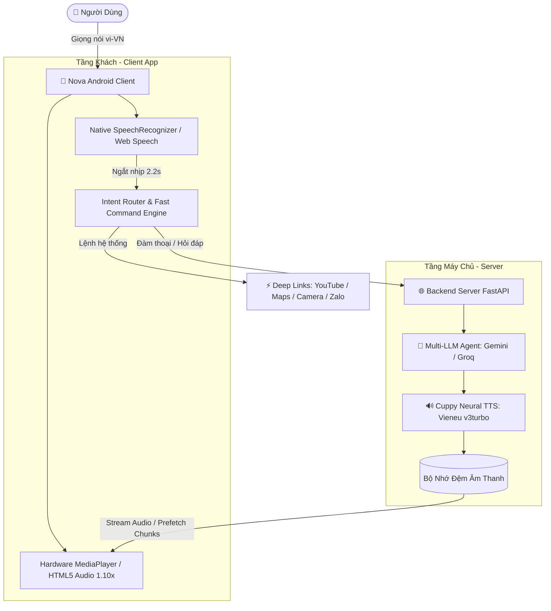

# 🔮 Nova Assistant — Trợ Lý Ảo Đàm Thoại AI Tiếng Việt Thông Minh

[](LICENSE)
[](https://github.com/wtrg/nova-voice-assistant)
[](https://github.com/wtrg/nova-voice-assistant)
[](https://github.com/wtrg/nova-voice-assistant)

**Nova Assistant** là hệ thống trợ lý ảo đàm thoại hai chiều thời gian thực (Full-Duplex Voice Assistant) thuần tiếng Việt, kết hợp giữa ứng dụng di động Android gốc, Web View tương tác hiện đại và máy chủ não bộ AI đa tầng với giọng đọc Saydi Cuppy độc quyền.

---

## 🌟 Điểm Nổi Bật (Key Features)

- 🎙️ **Đàm Thoại Tự Nhiên & Ngắt Nhịp 2.2s**:
  - Tự động phát hiện khoảng dừng nói (silence detection) trong đúng **2.2 giây** để gửi truy vấn, mang lại trải nghiệm trò chuyện mượt mà như người thật.
  - 100% In-App Speech Recognition: Loại bỏ hoàn toàn các cửa sổ popup Google Voice gây gián đoạn.
- 🔊 **Giọng Nói Cuppy Độc Quyền (Vieneu v3turbo)**:
  - Tích hợp giọng nữ Cuppy biểu cảm tự nhiên, nhí nhảnh.
  - Tối ưu tốc độ phát 1.10x (`PlaybackParams.setSpeed(1.10f)` & Web Audio `1.10x`) giúp phản hồi nhanh nhẹn, gãy gọn mà không méo tiếng.
  - Pipeline Prefetch: Chia nhỏ câu đầu tiên (<65 ký tự) để cất tiếng tức thì (<200ms) trong khi tiếp tục sinh các câu sau ở chế độ nền.
- 📱 **Điều Khiển Thiết Bị Android Đa Nhiệm**:
  - Mở ứng dụng và kích hoạt chức năng hệ thống bằng giọng nói: YouTube (tìm kiếm bài hát), Bản đồ Google Maps (dẫn đường), Camera, Báo thức, Zalo, Facebook, TikTok.
  - Cài đặt Trợ lý mặc định hệ điều hành & Background/Screen-off Hotword: `[DEVICE TEST REQUIRED]` *(Yêu cầu thiết bị phần cứng thực tế và OEM ROM service; chưa đánh dấu hoàn tất trong V3 do giới hạn môi trường headless CI/CD & Android background recognition).*
- 🧠 **Bộ Não AI Đa Tầng (Multi-LLM Engine)**:
  - Hỗ trợ linh hoạt **Google Gemini 2.5 Flash** và **Groq LLaMA 3.3 70B**.
  - Tự động nhận diện ý định (Intent Routing), ghi nhớ ngữ cảnh và phân biệt chính xác câu lệnh điều khiển thiết bị so với trò chuyện tự do.
- 🛡️ **Dự Phòng Offline & Mạng Kém**:
  - Tích hợp sẵn gói âm thanh gốc phòng thu trong APK cho các câu lệnh hệ thống cốt lõi (0ms latency, không phụ thuộc mạng).

---

## 🏗️ Kiến Trúc Hệ Thống (System Architecture)



---

## 📂 Cấu Trúc Mã Nguồn (Directory Structure)

```text
nova-voice-assistant/
├── client/                     # Ứng dụng Android & Web UI (Capacitor)
│   ├── android/                # Mã nguồn Android Studio gốc (Java / Gradle)
│   │   └── app/src/main/
│   │       ├── java/com/nova/assistant/MainActivity.java  # Native Bridge
│   │       └── AndroidManifest.xml
│   ├── www/                    # Giao diện điều khiển Web (TailwindCSS, HTML5)
│   │   ├── index.html          # Logic đàm thoại, Orb animation, Audio Pipeline
│   │   └── assets/             # Âm thanh phòng thu Cuppy gốc cho offline
│   ├── capacitor.config.json   # Cấu hình Capacitor Bridge
│   ├── package.json            # Cấu hình NPM và kịch bản test
│   └── test_router.py          # Bộ test 26 ca kiểm thử Intent Routing
├── server/                     # Máy chủ AI & Neural TTS (Python FastAPI)
│   ├── core/
│   │   ├── agent.py            # Quản lý LLM (Gemini / Groq) và prompt
│   │   ├── vieneu_cuppy.py     # Engine tổng hợp giọng nói Cuppy Neural TTS
│   │   ├── os_control.py       # Lệnh điều khiển hệ điều hành
│   │   ├── stt.py              # Xử lý nhận dạng giọng nói backend
│   │   ├── tts.py              # Đa luồng Text-To-Speech fallback
│   │   └── scheduler.py        # Quản lý nhắc việc & lịch hẹn
│   ├── server.py               # FastAPI endpoints (/api/chat, /api/cuppy-tts)
│   ├── config.py               # Quản lý cấu hình & biến môi trường
│   ├── requirements.txt        # Danh sách thư viện Python
│   └── .env.example            # Bản mẫu cấu hình biến môi trường
├── .gitignore
├── LICENSE                     # Giấy phép mã nguồn mở MIT
└── README.md
```

---

## 🚀 Hướng Dẫn Cài Đặt & Chạy Thử (Quick Start)

### 1. Khởi Chạy Backend Server (Python)

#### Yêu cầu:
- Python 3.10+
- FFmpeg (khuyến nghị cho xử lý âm thanh)

```bash
# 1. Đi vào thư mục server
cd server

# 2. Tạo môi trường ảo và kích hoạt
python -m venv venv
# Trên Windows:
venv\Scripts\activate
# Trên Linux/macOS:
source venv/bin/activate

# 3. Cài đặt các thư viện phụ thuộc
pip install -r requirements.txt

# 4. Thiết lập biến môi trường
cp .env.example .env
# Mở file .env và điền GEMINI_API_KEY hoặc GROQ_API_KEY của bạn

# 5. Khởi động máy chủ FastAPI
uvicorn server:app --host 0.0.0.0 --port 8000 --reload
```

---

### 2. Biên Dịch Ứng Dụng Android (Client)

#### Yêu cầu:
- Node.js 22+ & NPM
- Android Studio / Android SDK (API 34+)
- JDK 21+

```bash
# 1. Đi vào thư mục client
cd client

# 2. Cài đặt các gói npm
npm install

# 3. Đồng bộ giao diện web sang tài nguyên Android
npx cap copy android

# 4. Biên dịch file APK gỡ lỗi (Debug APK)
cd android
./gradlew assembleDebug
# Trên Windows:
gradlew.bat assembleDebug
```

File APK sau khi biên dịch xong sẽ nằm tại:  
`client/android/app/build/outputs/apk/debug/app-debug.apk`

---

## 🧪 Kiểm Thử Tự Động (Automated Testing)

Dự án đi kèm bộ test toàn diện kiểm tra nhận dạng giọng nói, điều hướng lệnh và đàm thoại:

```bash
cd client
python test_router.py
```

Kết quả: **26/26 ca kiểm thử thành công 100%**, bao gồm kiểm tra nhầm lẫn thực thể (entity collision test), điều hướng nhạc YouTube, chỉ đường Maps, kích hoạt camera và chat AI tự do.

---

## 📲 Tải Về Ứng Dụng (Download APK)

Bạn có thể tải ngay bản APK cài đặt sẵn tại mục [Releases](https://github.com/wtrg/nova-voice-assistant/releases) của kho lưu trữ này.

---

## 📄 Giấy Phép (License)

Dự án được phát hành theo giấy phép [MIT License](LICENSE). Tự do sử dụng, chỉnh sửa và tích hợp cho mục đích cá nhân lẫn thương mại.
