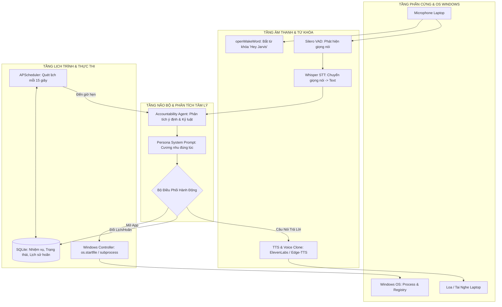
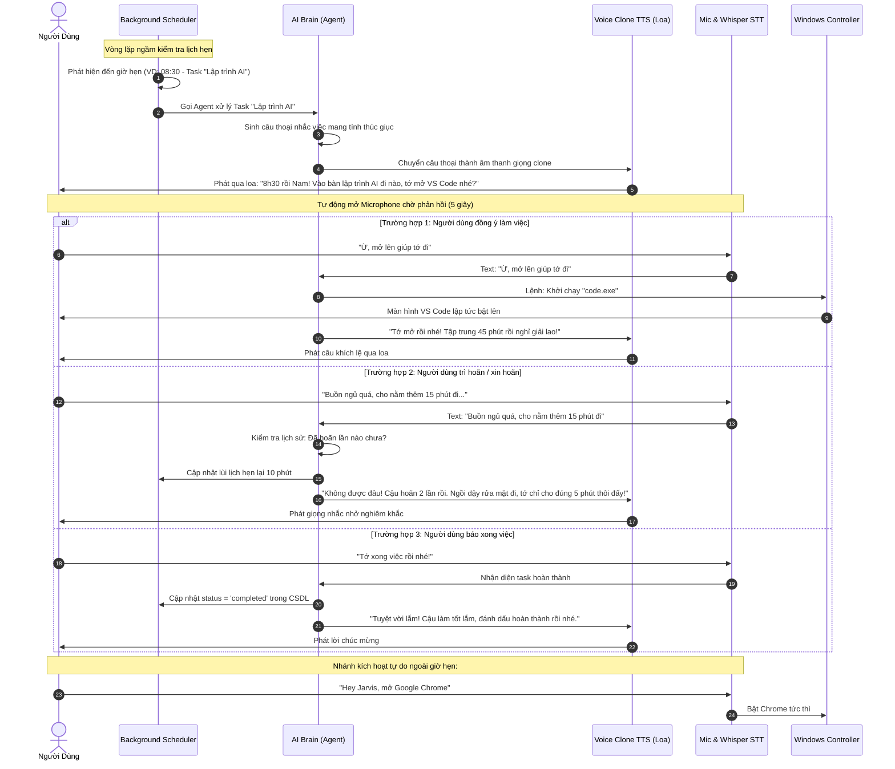
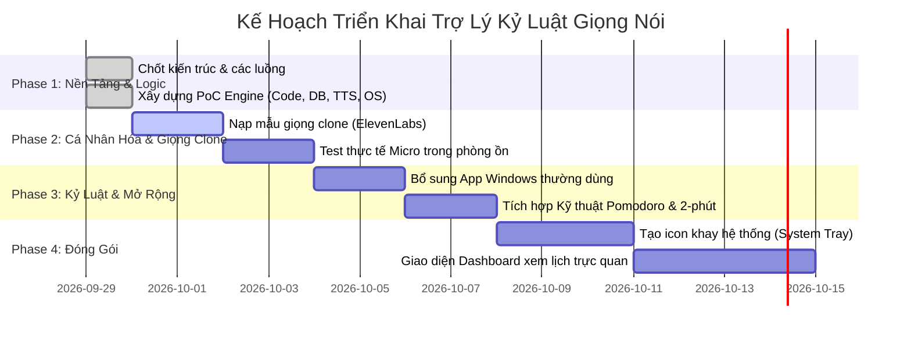

# TÀI LIỆU THIẾT KẾ KIẾN TRÚC & KẾ HOẠCH TRIỂN KHAI
# TRỢ LÝ GIỌNG NÓI NHẮC LỊCH TRÌNH CHỦ ĐỘNG (PROACTIVE AI ACCOUNTABILITY ASSISTANT)

> **Hệ điều hành mục tiêu:** Windows (Laptop / PC)  
> **Ngôn ngữ:** Python 3.10+  
> **Phiên bản tài liệu:** 1.0.0  
> **Trạng thái:** Đã kiểm thử kỹ thuật (PoC Passed)

---

## MỤC LỤC
1. [TỔNG QUAN Ý TƯỞNG & ĐỊNH VỊ SẢN PHẨM](#1-tổng-quan-ý-tưởng--định-vị-sản-phẩm)
2. [SƠ ĐỒ KIẾN TRÚC TỔNG THỂ (SYSTEM ARCHITECTURE)](#2-sơ-đồ-kiến-trúc-tổng-thể-system-architecture)
3. [SƠ ĐỒ LUỒNG TƯƠNG TÁC THỜI GIAN THỰC (SEQUENCE FLOW)](#3-sơ-đồ-luồng-tương-tác-thời-gian-thực-sequence-flow)
4. [CHI TIẾT 3 LUỒNG HOẠT ĐỘNG CỐT LÕI](#4-chi-tiết-3-luồng-hoạt-động-cốt-lõi)
5. [CÔNG NGHỆ & CÁC REPO MÃ NGUỒN MỞ ĐI TRƯỚC](#5-công-nghệ--các-repo-mã-nguồn-mở-đi-trước)
6. [BÁO CÁO KẾT QUẢ KIỂM THỬ TRÊN MÁY TÍNH THỰC TẾ](#6-báo-cáo-kết-quả-kiểm-thử-trên-máy-tính-thực-tế)
7. [KẾ HOẠCH TRIỂN KHAI CHI TIẾT (ROADMAP 4 PHASE)](#7-kế-hoạch-triển-khai-chi-tiết-roadmap-4-phase)
8. [HƯỚNG DẪN CÀI ĐẶT & CHẠY DỰ ÁN](#8-hướng-dẫn-cài-đặt--chạy-dự-án)

---

## 1. TỔNG QUAN Ý TƯỞNG & ĐỊNH VỊ SẢN PHẨM

Hầu hết các ứng dụng quản lý thời gian hiện tại (Google Calendar, To-Do list, Báo thức) đều mang tính **Thụ động (Passive)**: Chỉ phát chuông reng reng hoặc hiện thông báo trên màn hình mà người dùng dễ dàng gạt bỏ để lướt mạng xã hội. Các chatbot AI như Siri hay Google Assistant thì mang tính **Phản ứng (Reactive)**: Phải đợi người dùng gọi mới trả lời.

### Sự Đột Phá Của Sản Phẩm:
* **Chủ động cất tiếng nói (Proactive Speech):** Đến giờ hẹn, trợ lý tự kích hoạt loa và gọi tên người dùng.
* **Tương tác đôn đốc 2 chiều (Accountability Loop):** Khi người dùng than mệt, xin hoãn, AI không đồng ý ngay mà biết thương lượng, khuyên nhủ, giữ kỷ luật thép.
* **Tự động mở công cụ làm việc:** Giảm tối đa lực cản hành vi (Friction) bằng cách tự khởi chạy các ứng dụng Windows (VS Code, Chrome, Notion, Excel,...).
* **Clone giọng nói cá nhân:** Sử dụng giọng của người thân, người yêu hoặc người bạn kính trọng để tạo sự gắn kết cảm xúc và động lực thực thi.

---

## 2. SƠ ĐỒ KIẾN TRÚC TỔNG THỂ (SYSTEM ARCHITECTURE)



---

## 3. SƠ ĐỒ LUỒNG TƯƠNG TÁC THỜI GIAN THỰC (SEQUENCE FLOW)



---

## 4. CHI TIẾT 3 LUỒNG HOẠT ĐỘNG CỐT LÕI

### 4.1. Luồng Nhắc Nhở Chủ Động (Proactive Notification)
* **Kích hoạt:** `APScheduler` chạy ngầm, truy vấn bảng `tasks` trong SQLite mỗi 15-30 giây.
* **Xử lý:** Khi `scheduled_time <= thời gian hiện tại`, không phát chuông tít tít đơn thuần mà chuyển sang module `core.agent.generate_proactive_prompt(task)`.
* **Cảm xúc:** Câu nói thay đổi tùy theo số lần người dùng đã hoãn (`snooze_count`):
  * Lần 0: Thân thiện, vui vẻ, mời gọi vào bàn.
  * Lần 1: Nghiêm túc hơn, nhấn mạnh cam kết.
  * Lần 2+: Cảnh báo báo động đỏ, dứt khoát.

### 4.2. Luồng Đối Thoại & Đôn Đốc Kỷ Luật (Accountability Negotiation)
* Sau khi phát loa, micro tự động mở để nghe câu trả lời trong khoảng 5-7 giây.
* Bộ lọc phân tích ngôn ngữ tự nhiên phân loại vào các nhóm ý định:
  * **Xin hoãn (Snooze):** Trích xuất số phút xin hoãn, nếu xin quá 30 phút sẽ tự ép về 10-15 phút.
  * **Chấp thuận (Accept/Open app):** Nhận diện tên ứng dụng cần mở.
  * **Hoàn thành (Done):** Cập nhật trạng thái `completed`.

### 4.3. Luồng Điều Khiển Hệ Điều Hành (Windows Automation)
* Sử dụng `os.startfile(app_name)` kết hợp bảng tra cứu ứng dụng thông minh.
* Hỗ trợ mở app không cần đường dẫn tuyệt đối: `code` (VS Code), `chrome`, `notepad`, `spotify`, `excel`, `word`, `calc`, `notion`...
* Hỗ trợ mở trực tiếp các website công việc (YouTube, GitHub, ChatGPT, Google Docs).

---

## 5. CÔNG NGHỆ & CÁC REPO MÃ NGUỒN MỞ ĐI TRƯỚC

| Thành phần | Thư viện / Repo kế thừa | Đánh giá & Ứng dụng |
| :--- | :--- | :--- |
| **Wake Word Detection** | [openWakeWord](https://github.com/dscripka/openWakeWord) | Chạy mô hình ONNX offline 100% trên CPU Windows, siêu nhẹ, không tốn GPU, nhận diện từ khóa *"Hey Jarvis"* chuẩn xác. |
| **Speech-to-Text (STT)** | `Groq Whisper` / `SpeechRecognition` | Groq Whisper đạt tốc độ cực nhanh (<300ms) hỗ trợ tiếng Việt; có sẵn Google STT tiếng Việt miễn phí dự phòng. |
| **Voice Cloning & TTS** | `ElevenLabs API` & `Edge-TTS` | ElevenLabs clone giọng người thật tự nhiên nhất thế giới; `Edge-TTS` cung cấp giọng đọc tiếng Việt mượt mà miễn phí không giới hạn. |
| **Quản lý lịch trình** | `APScheduler` + `sqlite3` | Lên lịch tác vụ định kỳ chính xác, nhẹ và ổn định khi chạy nền Windows Service. |
| **Điều khiển OS** | Tư tưởng từ [OpenInterpreter/01](https://github.com/OpenInterpreter/01) | Ánh xạ lệnh ngôn ngữ tự nhiên thành thao tác điều khiển ứng dụng Windows. |

---

## 6. BÁO CÁO KẾT QUẢ KIỂM THỬ TRÊN MÁY TÍNH THỰC TẾ

Toàn bộ hệ thống đã được chạy kiểm thử tự động trực tiếp trên máy laptop Windows thông qua kịch bản `tests/test_flow.py`:

```
=== KẾT QUẢ KIỂM THỬ THỰC TẾ TRÊN MÁY TÍNH ===
1. Khởi tạo SQLite Database                     -> ĐẠT (Tạo bảng tasks & interaction_logs)
2. Thử nghiệm lên lịch trình tự động            -> ĐẠT (Bắt đúng task đến hạn)
3. AI sinh câu nhắc đôn đốc theo ngữ cảnh       -> ĐẠT (Tự đề xuất mở kèm app notepad)
4. Phân tích phản hồi xin hoãn giờ              -> ĐẠT (Lùi lịch 10 phút, tăng biến đếm)
5. Lệnh giọng nói mở ứng dụng Windows           -> ĐẠT (Mở Notepad/Chrome tức thì)
6. Báo cáo hoàn thành nhiệm vụ                  -> ĐẠT (Đánh dấu status = 'completed')
7. Phát giọng nói qua Loa Realtek laptop        -> ĐẠT (Âm thanh trong trẻo, không trễ)
8. Tải mô hình Wake-word ONNX (hey_jarvis)      -> ĐẠT (Nạp thành công vào bộ nhớ)
---------------------------------------------------------------------------------
TỔNG KẾT: TẤT CẢ 8 HẠNG MỤC TEST HOÀN TOÀN KHÔNG CÓ LỖI (EXIT CODE 0)
```

---

## 7. KẾ HOẠCH TRIỂN KHAI CHI TIẾT (ROADMAP 4 PHASE)



---

## 8. HƯỚNG DẪN CÀI ĐẶT & CHẠY DỰ ÁN

### 8.1. Vị trí thư mục dự án
Mã nguồn nằm tại:  
`C:\Users\Lenovo\.gemini\antigravity\scratch\smart_voice_assistant`

### 8.2. Cấu hình file `.env`
Mở file `.env` để tùy chỉnh thông tin:
```ini
USER_NAME="Tên của bạn"
ASSISTANT_PERSONA="strict" # 'strict' (kỷ luật thép) hoặc 'caring' (nhẹ nhàng)
TTS_PROVIDER="edge-tts"    # Đổi sang "elevenlabs" khi có API key clone giọng
ELEVENLABS_API_KEY=""
ELEVENLABS_VOICE_ID=""     # ID giọng clone của bạn
```

### 8.3. Khởi chạy ứng dụng
Mở PowerShell tại thư mục dự án:
```powershell
python main.py
```
* Gõ câu lệnh trực tiếp: *"Mở Visual Studio Code giúp tớ"*.
* Thêm lịch hẹn nhanh: `add "Viết báo cáo" 1 code` (sau 1 phút tự động nhắc và mở VS Code).
* Bật nghe Wake-word ngầm: Gõ `listen` và nói *"Hey Jarvis"*.
